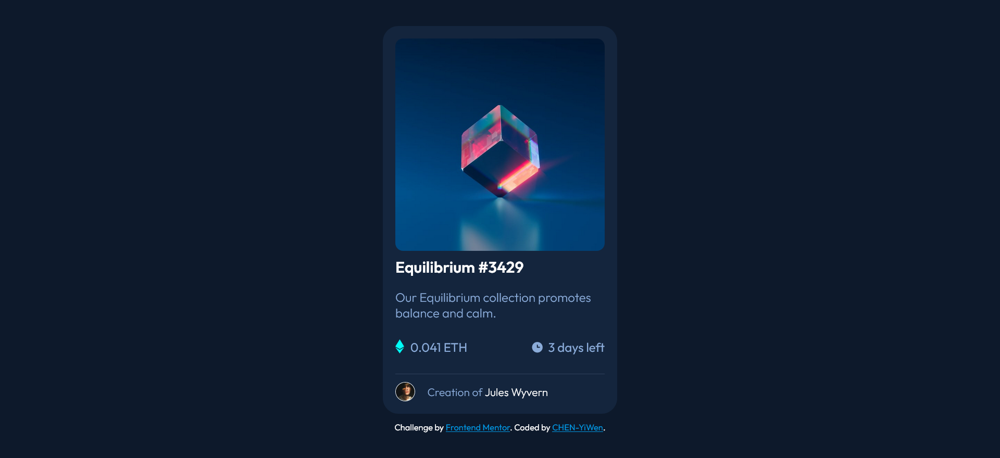

# Frontend Mentor - NFT preview card component solution

This is a solution to the [NFT preview card component challenge on Frontend Mentor](https://www.frontendmentor.io/challenges/nft-preview-card-component-SbdUL_w0U). Frontend Mentor challenges help you improve your coding skills by building realistic projects. 

## Table of contents

- [Overview](#overview)
  - [The challenge](#the-challenge)
  - [Screenshot](#screenshot)
  - [Links](#links)
- [My process](#my-process)
  - [Built with](#built-with)
  - [What I learned](#what-i-learned)
  - [Useful resources](#useful-resources)
- [Author](#author)
- [Acknowledgments](#acknowledgments)

**Note: Delete this note and update the table of contents based on what sections you keep.**

## Overview

### The challenge

Users should be able to:

- View the optimal layout depending on their device's screen size
- See hover states for interactive elements

### Screenshot



### Links

- Solution URL: [Add solution URL here](https://your-solution-url.com)
- Live Site URL: [Add live site URL here](https://your-live-site-url.com)

## My process

### Built with

- Semantic HTML5 markup
- CSS custom properties
- Flexbox


### What I learned
- This was one of my very first challenges on Frontend Mentor. I forgot to upload it after completing it. The part I had a problem with was creating the hover effect of the eye and overlaying color on the image. I followed [Mr. Coder](https://www.youtube.com/watch?v=l6sxh57ifSQ&t=1083s)'s tutorial to figure that part.

```html
<div class="image">
        
        <div class="overlay"></div>
        
      </div>
```
```css
.image{
    position: relative;
    cursor: pointer;
    margin-bottom:0.5rem;
}

.nft{
    width: 100%;
    height: 100%;
    border-radius: 10px;
}

.overlay{
    background-color: var(--Cyan);
    opacity: 0.3;
    position: absolute;
    top: 0;
    left: 0;
    width: 100%;
    height: 100%;
    border-radius: 10px;
    display: none;
}

.image:hover .overlay{
    display: block;
}

.eye{
    position: absolute;
    top: 50%;
    left: 50%;
    transform: translate(-50%, -50%); 
    display: none;   
}

.image:hover .eye{
    display: block;
}
```

### Useful resources

- [Mr. Coder]((https://www.youtube.com/c/MrCoderYt)) - His channel has videos where he demonstrates how to solve some Frontend Mentor's challenges. But I recommend only checking the tutorial if you are stuck with the challenge for a long while. It's more fun to get your own hands dirty.


## Author

- Frontend Mentor - [@CHEN-YiWen](https://www.frontendmentor.io/profile/CHEN-YiWen)


## Acknowledgments

I referred to [Mr.Coder](https://www.youtube.com/watch?v=l6sxh57ifSQ&t=1083s)'s video when I couldn't figure out how to create the hover effect on the image.